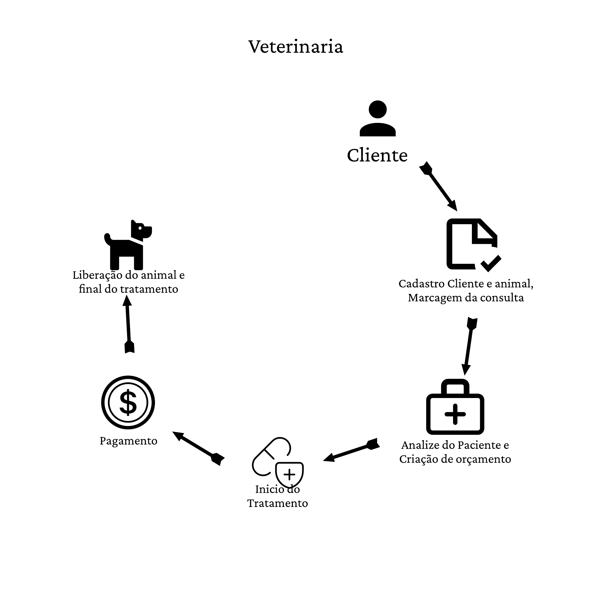

# Projeto Integrador - Clínica Veterinária

Alunos: [Miguel Bochi](github.com/MiguelBochiBarros) e [Juan Padilha](https://github.com/alujuan).

Links do projeto:

- [Documentação (esse documento)](github.com/MiguelBochiBarros/Panic_Donkey)
- [Backend](github.com/MiguelBochiBarros/pi-backend)
- [Frontend](github.com/MiguelBochiBarros/pi-frontend)

# Modelos de Sistemas

## 3- Ordem de Serviço (O.S.)

**Veterinária**

O Sr. Bob, nosso cliente, se formou em veterinária de animais de pequeno porte e exóticos e decidiu abrir um negócio, onde ele é responsável pelos cuidados dos animais e sua ajudante Nã realiza os atendimentos aos clientes. Com sua visão empreendedora, ele sentiu a necessidade de um software que auxilie sua ajudante nas tarefas diárias. Para isso, ele deseja um sistema que gerencie os clientes, orçamentos, tratamentos e saída dos animais. Sendo um negócio pequeno, é muito importante que ele consiga ter relatórios que lhe ajudem na gestão do consultório, como dos status dos serviços.

# Situação Problema

**Introdução**

A empresa é uma pequena veterinária chamada _Biologic Animal Farm_ que começou a ter um crescimento nos últimos meses. Seu dono é um veterinário chamado Sr. Bob, que faz os cuidados e o tratamento dos animais. Junto a isso, tem sua funcionária Nã, que ajuda na recepção dos clientes e da manutenção geral.

A empresa funciona em etapas: cliente, cadastro, análise do paciente e orçamento, análise de crédito, tratamento, pagamento inicial e liberação do animal.

- **Cliente**: o cliente faz o seu cadastro e de seu animal na recepção;
- **Cadastro**: é feito pelo recepcionista e junto é marcado uma consulta;
- **Análise do paciente e orçamento**: na consulta, é avaliada a situação do animal e após isso é feito um orçamento (material e tempo);
- **Pagamento inicial**: pagamento inicial, podendo ser em prestações ou à vista.
- **Tratamento**: o tratamento pode ser feito de diversas formas, desde cirurgias até medicações;
- **Liberação do animal**: após o tratamento, o animal é liberado.

Verificou-se que sem um sistema fica difícil categorizar os animais que estão em tratamento ou já saíram dele, e também temos dificuldade em ver como está o pagamento do tratamento e confirmar se foi feita a análise de crédito.

# Descrição da proposta

Criar uma aplicação que auxilie na retenção de dados referente aos animais, pagamentos e tratamentos, evitando a perda de informações.

**MELHORAR, COLOCANDO O OBJETIVO.**

**Alguns pontos importantes a se destacar são:**

- Ter um acesso mais rápido ao dados relacionados aos animais e seus pagamentos sem a perda de informações.
- O gestor terá acesso total ao sistema, podendo apagar dados e os funcionários terão acesso parcial podendo apenas criar cadastros e pesquisar dados.
- As principais funcoinalidades do sistema serão: cadastro, login, pesquisa e verificação de dados.
- O sistema terá um sistema de permissão de usuários, sendo que os de maior nível terão a capacidade de manipular os dados podendo deletá-los. Já os usuários de baixo nível poderão apenas cadastrar e pesquisar.

# Regras de negócio

- **RN01 - Início do atendimento:** Para fazer o atendimento é necessário o cadastro do cliente e do animal.
- **RN02 - Análise do paciente:** Para que ocorra a análise, o paciente deve estar cadastrado e com o horário marcado.
- **RN03 - Análise do orçamento:** O orçamento só pode ser registrado após a análise do paciente.
- **RN04 - Tratamento:** O tratamento só pode ser feito em um animal já cadastrado e com a análise.
- **RN05 - Pagamento e liberação do animal:** O pagamento inicial só pode ser feito após o tratamento do animal e assim, é possível haver a liberação do animal.

# Requisitos Funcionais

- # Entrada

- **RF001 - Cadastro de clientes:** O sistema deve permitir o cadastro de novos clientes e o registro de seus dados no banco de dados.

  - **Dados necessários**: Nome, Cpf, Telefone, Gmail, login, senha.
  - **Usuários**: Apenas usuarios de níveis igual ou acima de funcionário.

- **RF002 - Cadastro de animais:** O sistema deve permitir o cadastro de animais dos clientes e o registro de seus dados no banco de dados.
  - **Dados necessários**: Nome, nome do dono, tipo sanguinio, espécie, sexo, idade.
  - **Usuários**: Apenas usuários de níveis igual ou acima de funcionário.
- **RF003 Casdastro do funcionário:** O sistema deve registrar os dados cadastrados dos funcionários dentro da base de dados.
  - **Dados necessários**: Nome, Cpf, Telefone,Login, Senha, Gmail, Cargo.
  - **Usuários**: Apenas usuarios de cargo gerente.
- **RF004 Relatorio de atendimento:** O sistema deve registrar os dados do relatório informado pelo funcionário responsalvel pela consulta.
  - **Dados necessários**: Nome(Cliente),Nome(funcionário),Nome(animal), Relatorio.
  - **Usuários**: Apenas usuarios de níveis igual ou acima de funcionário.
- # Processamento
- **RF005 Autenticação de usuario:** O sistema deve comparar os dados de Cadastro Cliente ou Cadastro de funcionário para verificar a permissão de acesso ao software.
  - **Dados necessários**: login, senha.
  - **Usuários**: Todos os níveis de usuario.
- **RF006 mudar senha:** O sistema deve ser capaz de alterar os dados de senhas de Cadastro de Cliente e Cadastro de funcionário.
  - **Dados necessários**: login, CPF.
  - **Usuários**:Apenas usuários de níveis igual ou acima de funcionário.
- **RF007 Agendamento de consulta:** Usara os dados de Cadastro de Cliente e Cadastro Animal para o agendemanto.
  - **Dados necessários**: Nome(Cliente),Nome Animal,especie, sexo, data.
  - **Usuários**:Todos os usuarios.
- # Saída
- **RF008 Calendario:** O sistema deve fornecer ao usuario um calendario com as datas das consultas ou conograma de atendimento por meio do porecesso de Agendamento de consulta.
  - **Dados necessários**: login, senha, data.
  - **Usuários**: Todos os níveis de usuario.
- **RF009 Relatorio de atendimento:** O sistema deve mostrar um relatorio sobre o atendimento de seu animal.
  - **Dados necessários**: .
  - **Usuários**:Todos os níveis de usuarios.

# Requisitos não funcionais

- **RNF - Navegadores aprovados:** O sistema será reconhecido somente nos navegadores Google Chrome e Mozilla Firefox.

- **RNF - Agendamento sem cadastro:** O sistema não devera permitir agendamento sem uma conta cadastrada.

- **RNF - Cadastro de animais indefinidos:** O sistema não deve permitir o cadastro de espécies que não estão pré-definidas.

- **RNF - Consulta simultânea :** O sistema não pode permitir o agendamento de duas consultas com o mesmo funcionário ao mesmo tempo.

- **RNF005 - Registro do atendimento:** O sistema não deve permitir o resgistro do atendimento antes da consulta.
